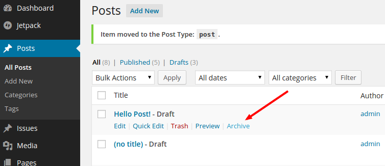
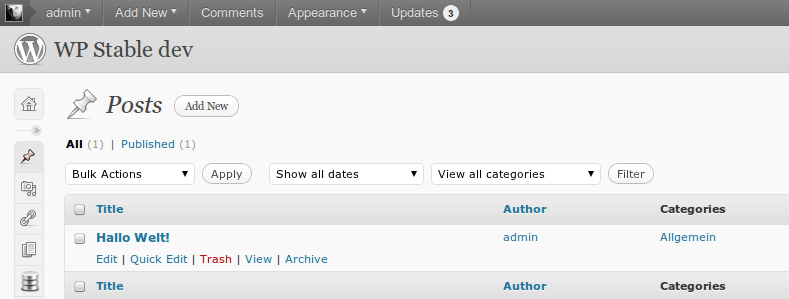

# Archive
Archive your post types, also possible with cron and list via shortcode on frontend.

## Description
Archive your post types, also possible via cron; but only active via var inside the php-file.
Use the shortcode [archive] to list al posts from Archive with status publish to a page or post.
The Shortcode can use different params and use the follow defaults.

```php
'count'         => -1, // count or -1 for all posts
'category'      => '', // Show posts associated with certain categories.
'tag'           => '', // Show posts associated with certain tags.
'post_status'   => 'publish', // status or all for all posts
'echo'          => 'true', // echo or give an array for use external
'return_markup' => 'ul', // markup before echo title, content
'title_markup'  => 'li', // markup before item
'content'       => 'false', // view also content?
'debug'         => 'false' // debug mor vor view an array
```

An example for use shortcode with params: `[archive count="10" content="true"]`

Also you can change the parameters to create the custom post type of the Archiv via the filter hook `archive_post_type_arguments`.

### Crafted by [Inpsyde](http://inpsyde.com) &middot; Engineering the web since 2006.
Yes, we also run that [marketplace for premium WordPress plugins and themes](http://marketpress.com).

## Installation
### Requirements
* WordPress version 3.0 and later
* PHP 5.3

### Installation
1. Unpack the download-package
1. Upload the folder and all folder and files includes this to the `/wp-content/plugins/` directory
1. Activate the plugin through the 'Plugins' menu in WordPress
1. Now you find a link on all post types for archive the item

## Screenshots
1. Possibility to archive on posts, WP 4.2-alpha


2. Possibility to archive on posts, WP 3*


3. In Archive, also possible to restore, WP 3*


## Other Notes
#### License
Good news, this plugin is free for everyone! Since it's released under the GPL, you can use it free of charge on your personal or commercial blog. But if you enjoy this plugin, you can thank me and leave a [small donation](http://bueltge.de/wunschliste/ "Wishliste and Donate") for the time I've spent writing and supporting this plugin. And I really don't want to know how many hours of my life this plugin has already eaten ;)

#### Localizations
* Thanks to [Frank Bültge](http://bueltge.de/ "Frank Bültge") for german language file
* Thanks to [Brian Flores](http://www.inmotionhosting.com/) for spanish translation
* Lithuanian translation files by [Vincent G](http://www.host1plus.com)